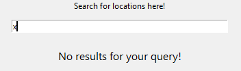

# Welcome to the Skyrim Location Crawler Documentation

By: Reis M. Gadsden\
Version: v1.1.0

## Table of Contents
1. [Overview](#overview)
    1. [Purpose](#purpose)
    2. [Base Site](#basesite)
    3. [Use](#use)
2. [Setup](#setup)
    1. [Install Python 3](#python)
    2. [Install Libraries](#libs)
3. [Starting for the first time](#starting)
    1. [Starting the Crawl](#initializing)
    2. [Walkthrough](#walkthrough)
4. [Exploring the Features](#features)
    1. [Reactive Search](#search)
    2. [Viewing Results](view)
    2. [Check out all locations!](#all_loc)
    3. [Check out a random location!](#rand_loc)
    4. [Check out the distributions of locations in each hold!](hold_dist)
    5. [Check out the distributions of the types of locations!](type_dist)
    6. [Check out the handy hold reference table!](#hold_ref)
    7. [View JSON](#json)
    8. [Exit Skyrim Location Crawler](#exit)
6. [Methods, Fields, Classes](#methods)
    1. [skyrimloccrawl.py](#crawl)
    2. [skyrimloccrawlgui.py](#gui)

# 1. Overview 
*  <b>Purpose</b>: This program will take data collected in a scrape from the locations on the Elder Scrolls Wiki page for Skyrim and
build a GUI that creates a more user friendly, navigable format for the idea.

*  <b>Base Site</b>: https://elderscrolls.fandom.com/wiki/Locations_(Skyrim)

*  <b>Use</b>: Mostly just a fun program for exploring locations in TESV: Skyrim, however the code does contain a lot of general use code that could be used to scrape other things on the wiki.

# 2. Setup 
## 1. Install Python3
    * <a href="https://www.python.org/downloads/">https://www.python.org/downloads/ </a>
## 2. Install necessary Libraries
Open up your local machines command prompt and navigate to the directory where you saved the files
* BeautifulSoup
    *       C:\...\SkyrimLocCrawl>pip install bs4
* RobotFileParser
    *       C:\...\SkyrimLocCrawl>pip install urllib.robotparser 
* Requests
    *       C:\...\SkyrimLocCrawl>pip install pip._vendor
* Random
    *       C:\...\SkyrimLocCrawl>pip install random
* Time
    *       C:\...\SkyrimLocCrawl>pip install time
* Threading
    *       C:\...\SkyrimLocCrawl>pip install threading
* JSON
    *       C:\...\SkyrimLocCrawl>pip install json
* Ordered Dictionaries
    *       C:\...\SkyrimLocCrawl>pip install collections
* Webbrowser
    *       C:\...\SkyrimLocCrawl>pip install webbrowser
* TKinter Fonts
    *       C:\...\SkyrimLocCrawl>pip install tkinter.font
        or
    *       C:\...\SkyrimLocCrawl>pip install tkinter
* TKinter.ttk
    *       C:\...\SkyrimLocCrawl>pip install tkinter.ttk
* TKinter.tix
    *       C:\...\SkyrimLocCrawl>pip install bs4.tkitner,tix
* Subprocess
    *       C:\...\SkyrimLocCrawl>pip install subprocess
<i>Note: Most of these are included with Python, so unless you did a bare bones install most of these will already be included</i>

# 3.  Starting for the first time
## 1.  Starting the program.
To start the program for the first time, simply type in the command prompt
*       C:\...\SkyrimLocCrawl>python skyrimloccrawlgui.py
Or simply run <i>skyrimloccrawlgui.py</i> in a Python IDE.

## 2.  Walkthrough
Upon starting you will be greeted by the following welcome screen.
 

 
 

You will then be prompted to enter a value into the entry field.
The value entered into this field will determine how many random locations are gathered.
 

 
 

After this simply click the button that says <i>"Crawl"</i>, and as long as you entered valid input the crawl will begin.
 

 

 
<i>Note: Since this program actively crawls the website, it goes at a slow pace as to not overload the server. Therefore you might be on this screen for a while. However this page will display loading messages, to let you know it did not freeze.</i>
 
 

Once the crawler is finished you will land on this page.
 

# 4. Exploring the features
This section will give a detailed overview of each feature in the current version of the program. It will also show to use and navigate the main part of the program.
 

## 1. Reactive Search
Skyrim Location Crawler includes a reactive search function! Simply enter some text into the search bar to begin!
 

 
 
Reactive search features include will pull up the first five locations that match. If there are less then five matches for your search it will pull up whatever results there are. Also, if there are no matching searches, it will let you know.
 

 

 
 
Clicking on any of these results will allow to view them, regard the <a href="#view">next section</a> to learn more about the results.

## 2. Viewing Results
This section will give a quick overview of the results that will come up for locations. <i>Note: there will be variations based on how you get to the location, however this a generalized summary of navigating displayed results</i>
 
The features that are included in each displayed results are:
* URL on Skyrim Wiki
* Name of the location
* Location Type (Cave, Inn, Shop, etc.)
* Relative Location (Specific city or location in world)
* Location ID(s)
* A quick summary of the location
 
<i>Note: Sometimes entries do not put the information on the page, or sometimes in the correct spot, if there is a piece of information missing on the displayed results make sure to check out the URL at the top of the page</i>
 
 
The following image gives a general picture of which each displayed results will look like.
 

 
 
To go to the wiki page for the location simply left click on the link at the top of the result.
 

 
 
At the bottom of the wiki page there will be some extra options depending on how you arrived to that page. Below is how to return back to the start page after clicking an element from the reactive search. If you want to learn about the options for results displayed from other ways click one of the following: <a href="#all_loc">All locations</a>, <a href="#rand_loc">Random location</a>; or simply scroll to the sections below.
 

## 3. Check out all locations!
### <i>Important Note: This application does not support mousewheel scrolling at the current time. If your pages require a scroll bar you will have to click and drag the scroll bar on the right hand side of the page.</i>
"Check out all locations!" allows you to view a list of all the locations gathered during the crawl and view any of their results to get started simply click "Check out all locations!".
 

 

 
 
Clicking on any result you are interested in will bring up its results.
 
 
Once you are done reading about your choosen location you can go back to viewing all the results.
 

 
 
After viewing all the results you wish to view to go back to start page simply click "Go back to search!" at the bottom of the All Locations list. (You might have to scroll pretty far down)
 

## 4. Check out a random location!
Skyrim Location Crawler allows you to pull up a random result from all crawled location to get pull up a random result simply click "Check out a random location!"
 

 
 
After pulling up a random result you have two options:
1. View another random
 

 
 
2. Go back to the start page
 

## 5. Check out the distributions of locations in each hold!
Skyrim Location Crawler will also generate a (at the time, poorly) formatted table displaying how many of locations land in each hold, and what percentage each hold has of the total locations crawled.
 

 

## 6. Check out the distributions of the types of locations!
### <i>Important Note: This application does not support mousewheel scrolling at the current time. If your pages require a scroll bar you will have to click and drag the scroll bar on the right hand side of the page.</i>
Skyrim Location Crawler will also generate a (also, poorly) formatted table displaying types of the locations crawled, as well as the types percentage of occurrence out of all types.
 

 

## 7. Check out the handy hold reference table!
Skyrim Location Crawler will also generate a (you guessed, poorly) formatted table displaying each of the holds, along with their corresponding Jarl and capital city. This data is gathered separately from the main crawl from <a href="https://elderscrolls.fandom.com/wiki/Holds">https://elderscrolls.fandom.com/wiki/Holds</a>
 
This table is mostly for fun but can be a handy reference, as well provide some extra information about the holds in general.
 

## 8. View JSON
Skyrim Location Crawler also supports the option to drop all the scraped info into a .json file, called <i>data.json</i>. To do this simply click on "View JSON"
 

 
 
If a .json has not already been created it will display a message and open up the files location in your file explorer, however if one has already been created it will simply just open its location in the file explorer.
 

 

 
 
Data.json will be formatted like as the following:
<pre><code>
{
    "https://elderscrolls.fandom.com/wiki/First_Location)URL" :
    {
        "Location Name: ": <i>"First_Location_Name"</i>,
        "Location Type: ": <i>"First_Location_Type"</i>,
        "Hold: ": <i>"First_Location_Hold"</i>,
        "Relative Location: ": <i>"First_Relative_Location"</i>,
        "Location Name: ": <i>"First_Location_Name"</i>,
        "Location ID(s): ": <i>"First_Location_IDs"</i>,
        "Summary: ": <i>"First_Location_Summary"</i>
    },
    .
    .
    .
    "https://elderscrolls.fandom.com/wiki/Last_LocationURL" :
    {
        "Location Name: ": <i>"Last_Location_Name"</i>,
        "Location Type: ": <i>"Last_Location_Type"</i>,
        "Hold: ": <i>"Last_Location_Hold"</i>,
        "Relative Location: ": <i>"Last_Relative_Location"</i>,
        "Location Name: ": <i>"Last_Location_Name"</i>,
        "Location ID(s): ": <i>"Last_Location_IDs"</i>,
        "Summary: ": <i>"Last_Location_Summary"</i>
    }
 }
</code></pre>
## 9. Exit Skyrim Location Crawler
There are two ways to exit the Skyrim Location Crawler:
1. Click the X in the top right
2. Click "Exit Skyrim Location Crawler"
 

 
 
If you choose the second option you will also be sent of with a nice little goodbye (this page stays up for 2 seconds then the application terminates)
 

# 5.  Methods, Fields, Classes
### 1. Methods, fields, and classes in: <i>skyrimloccrawl.py</i>
* <i>headers</i>
    * Main headers for the crawler, this tells the website what kind of machine you are running by default the value of headers is\
    <pre><code>headers = {'user-agent': 'Mozilla/5.0 (Windows NT 10.0; Win64; x64; rv:85.0) Gecko/20100101 Firefox/85.0'}</code></pre>
    However you should change it to your header to be friendly.
* <i>rp</i>
    * Initialization of the RobotFileParser
* <i>init_url</i>
    * Starting URL
* get_rp
    * Parameters
        * robot_url - URL of the robots.txt for the site.
    * Return
        * Returns a boolean value that tells whether or not the robots.txt allows crawling.
    * Purpose
        * Parse the robots.txt and see the rules for crawling the site. 
* get_page
    * Parameters
        * page_url - Tells the function what url to request.
        * site_count - Has default value none, was useful in version v0 as there was no GUI and everything was outputted to the console.
    * Return
        * Returns a new BeautifulSoup Object if the page is able to be parsed.
        * Return literal boolean value False if it cannot be parsed.
    * Purpose
        * Gets the page if it is reachable and pass it to a BeautifulSoup object in ordered to be parsed.
* <b>Crawler (Class)</b>\
Main class of the crawler. Contains everything to do with the actual crawling of the site, as well as parsing and making the information gathered useful.
    * <i>page_attr</i>
        * Dictionary designed to hold all data stored by using the URL as the key, and having another dictionary containing all attributes as the associated value.
    * <i>links</i>
        * A list that contains all of the URLs that are crawled to.
    * <i>robot_page</i>
        * String value that stores the robots.txt URL.
    * <i>robot_check</i>
        * Boolean value that stores whether or not the robots.txt allows us to crawl the site.
    * <i>base_page</i>
        * String value that holds the base URL of the site, allows to append relative hrefs to give us a full URL.
    * <i>crawl_page</i>
        * String value that holds the URL of the site we are currently crawling.
    * <i>hold_page</i>
        * String value that holds the URL of the page containing hold, capital city, and Jarl.
    * <i>sites_to_crawl</i>
        * Integer value that holds the validated user inputted value for how many sites are going to be crawled.
    * <i>hold_list</i>
        * List that holds the name of all the holds in Skyrim. Has one-to-one indexing with city_list and jarl_list.
    * <i>city_list</i>
        * List that holds all the names of cities in Skyrim. Has one-to-one indexing with hold_list and jarl_list.
    * <i>jarl_list</i>
        * List that holds all the names of Jarls in Skyrim. Has one-to-one indexing with hold_list and city_list.
    * <i>type_sum</i>
        * Integer value that keeps track of how many type instances were specified in the given page_attr dictionary.
    * <i>hold_sum</i>
        * Integer value that keeps track of how many hold instances were specified in the given page_attr dictionary.
    * \_\_init__
        * Parameters
            * base_url - contains the URL in which the crawl will start.
            * sites_to_crawl - contains the unvalidated user input for how many sites will be crawled.
        * Purpose
            * Validates user input so that a valid integer can be passed (for example: if a user enter 100000 even though there is only 562 total locations).
            * Breaks down base_url in order get robots.txt URL, hold page URL, and to give <i>base_page</i> a value.
            * Checks if robots.txt allows the crawl. Goes ahead and makes calls to populate_links and get_info if it can be parsed.
    * populate_links
        * Parameters
            * base_link - The page that the crawler will start at and gather location URLS.
        * Purpose
            * Populates the <i>links</i> field.
            * Checks for and culls duplicate links.
            * Chooses random links from all of the location links (This does not matter if the max value is used).
    * get_holds
        * Parameters
            * bs_obj - The BeautifulSoup object the will be used to gather data from the page.
        * Purpose
            * Populate the <i>hold_list</i> field with the hold name values as strings.
    * get_cities
        * Parameters
            * bs_obj - The BeautifulSoup object the will be used to gather data from the page.
        * Purpose
            * Populate the <i>city_list</i> field with the city name values as strings
    * get_jarls
        * Parameters
            * bs_obj - The BeautifulSoup object the will be used to gather data from the page.
        * Purpose
            * Populate the <i>jarl_list</i> field with the jarl name values as strings
    * get_info
        * Purpose
            * Keep track of how many sites have been crawled to.
            * Make calls to all functions that gather info from pages, including get_holds, get_cities, and get_jarls.
            * Push all gathered info into a dictionary and the push that dictionary into <i>page_attr</i> with the URL as the key.
    * get_loc_name
        * Parameters
            * bs_obj - The BeautifulSoup object the will be used to gather data from the page.
        * Return
            * Returns the name of location that was parsed from the location page.
        * Purpose
            * Get the name of the location that has been crawled to.
    * get_summary
        * Parameters
            * bs_obj - The BeautifulSoup object the will be used to gather data from the page.
        * Return
            * Returns the data contained in the first non cited \
 block
        * Purpose
            * Get the first descriptive paragraph from the location page.
            * Strip away any unnecessary tags from said paragraph.
            * Check to see if the paragraph is actually a description.
            * Return a default output if one cannot be found.
    * get_hold
        * Parameters
            * bs_obj - The BeautifulSoup object the will be used to gather data from the page.
        * Return
            * The hold that was found on the location page.
        * Purpose
            * Figure out which hold the location belongs to it will handle things such as hold not being specified anywhere or not in the data table.
    * get_loc
        * Parameters
            * bs_obj - The BeautifulSoup object the will be used to gather data from the page.
        * Return
            * The relative location of the location.
        * Purpose
            * Give the user an idea of where it is, if the page gives a relative location.
    * get_loc_type
        * Parameters
            * bs_obj - The BeautifulSoup object the will be used to gather data from the page.
        * Return
            * Return the type of the location, if applicable.
        * Purpose
            * Give insight on what the location is and to provide data for the get_type_summary method.
    * get_loc_ids
        * Parameters
            * bs_obj - The BeautifulSoup object the will be used to gather data from the page.
        * Return
            * Return all given Location IDs, if any were given.
        * Purpose
            * To collect all location ids in order to be readable.
    * get_hold_summary
        * Return
            * A dictionary that has holds as a key and the number of instances of locations in the hold as the associated value.
        * Purpose
            * Give some neat statistics.
            * Handle cases where a location might be a in multiple holds.
    * get_type_summary
        * Return
            * A dictionary that has types as a key and the number of instances of location types as the associated value.
        * Purpose
            * Some more neat statistics.
            * Handle cases of multiple types attributed to a location.
    * dump_to_json
        * Purpose
            * Dump all gathered info into a formatted .json file, as well as handle any potential errors.
* main
    * Purpose
        * Was useful in v0 as whole program ran in the console. Gathered and validated user input. It is now a deprecated function.
### 2. Methods, fields, and classes in: skyrimloccrawlgui.py
* <b>SkyrimLocGUI (Class)</b>
    * <i>page_attr</i>
        * Dictionary designed to hold all data stored by using the URL as the key, and having another dictionary containing all attributes as the associated value.
    * <i>dumped</i>
        * Boolean value that tells whether the user has dumped to a .json yet or not.
    * <i>crawler</i>
        * Crawler object
    * <i>e1var</i>
        * StringVar() for the location search Entry box.
    * <i>s1var</i>
        * StringVar() for the 1st search result.
    * <i>s2var</i>
        * StringVar() for the 2nd search result.
    * <i>s3var</i>
        * StringVar() for the 3rd search result.
    * <i>s4var</i>
        * StringVar() for the 4th search result.
    * <i>s5var</i>
        * StringVar() for the 5th search result.
    * <i>json_var</i>
        * StringVar() for the results of json_run.
    * <i>search_label1</i>
        * Initialization of the Label for the 1st search result.
    * <i>search_label2</i>
        * Initialization of the Label for the 2nd search result
    * <i>search_label3</i>
        * Initialization of the Label for the 3rd search result
    * <i>search_label4</i>
        * Initialization of the Label for the 4th search result
    * <i>search_label5</i>
        * Initialization of the Label for the 5th search result
    * \_\_init__
        * Purpose
            * Creates the root, main frame, main scroll window, as well as the first labels, button, and entry box.
    * start_crawl
        * Parameters
            * num_crawl - user input for how many sites to crawl
        * Purpose
            * Validate user input, update labels if user entered invalid input, and pass validated input to load_crawl and init_crawl
    * load_crawl
        * Parameters
            * num_crawl - user input for how many sites to crawl
        * Purpose
            * creates a loading page while the sites are being crawled
    * init_crawl
        * Parameters
            * num_crawl - user input for how many sites to crawl
        * Purpose
            * initializes new crawl object, populates <i>page_attr</i>, and makes a call to start_page after all sites have been crawled.
    * start_page
        * Purpose
            * Allow users to search for locations, dynamically!
            * Allow users to check out all locations that were crawled.
            * Allow users to go to a random locations results.
            * Allow users to check out the distribution of locations in holds.
            * Allow users to check out the distribution of location types.
            * Allow users to view a handy table of holds and their associated capital cities and jarls
            * Give users the option to dump to a .json file and view it in their file explorer.
            * Give users a way to exit the program other then hitting x.
        * Parameters
            * a - value given from trace (unused)
            * b - value given from trace (unused)
            * c - value given from trace (unused)
        * Purpose
            * update the search results as the user enters new characters and to handle cases where there are no results or the entry box is empty.
    * search_results
        * Parameters
            * chars - Current input in entry box.
        * Purpose
            * Dynamically gather results from <i>page_attr</i> as the user types
    * view_all_results
        * Purpose
            * Creates a page that contains all the results from the crawl and allow user to navigate to each individual page.
    * display_results
        * Parameters
            * val - The dictionary that is a value of the URL key in <i>page_attr</i>.
            * directed_from - An integer value that allows for better redirection.
        * Purpose
            * Render results from search for the user for a readable format.
            * Allow dynamic navigation
                * If user comes from clicking a search result only allow them to navigate pack to the start_page
                * If user comes from clicking a result from view_all_results only allow them to navigate back ot view_all_results
                * If a user come from a random page allow them to either go to another random page or go back to start_page.
    * render_holds
        * Purpose
            * Renders the hold reference table using info gathered from <b>skyrimloccrawl.py</b>
    * render_hold_sum
        * Purpose
            * Renders the hold summary table using info gathered from <b>skyrimloccrawl.py</b>
    * render_type_sum
        * Purpose
            * Renders the type summary table using info gathered from <b>skyrimloccrawl.py</b>
    * json_run
        * Purpose
            * Create a .json file from <i>page_attr</i> if not already dumped, and to open it up in the file explorer.
    * quit
        * Purpose
            * Give users a official way to exit the program, and to give a little goodbye message.
* main
    * Purpose
        * Create instance of SkyrimLocGUI and initialize the mainLoop for the GUI
